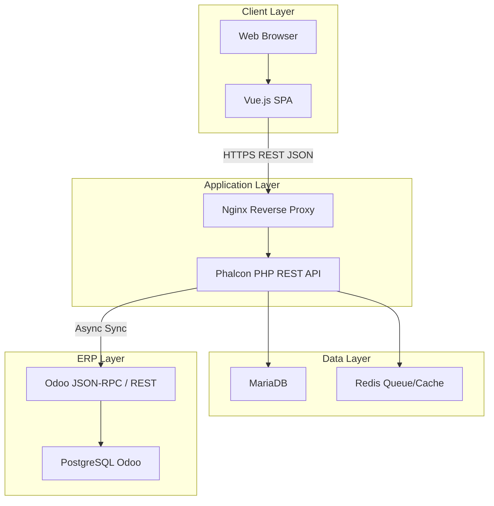
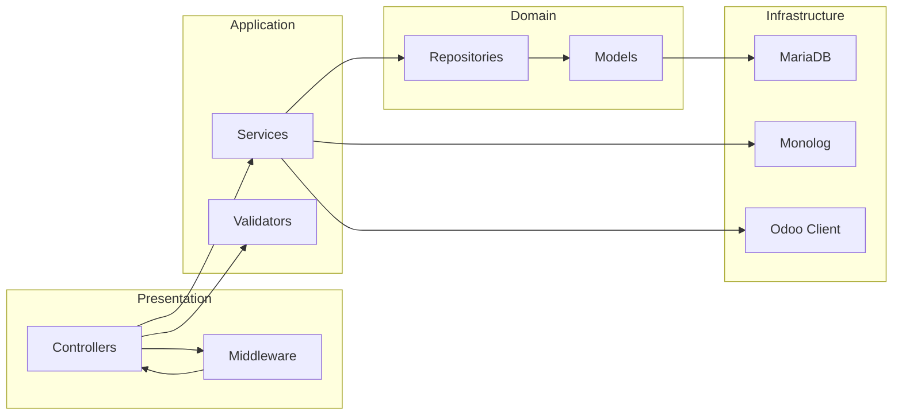
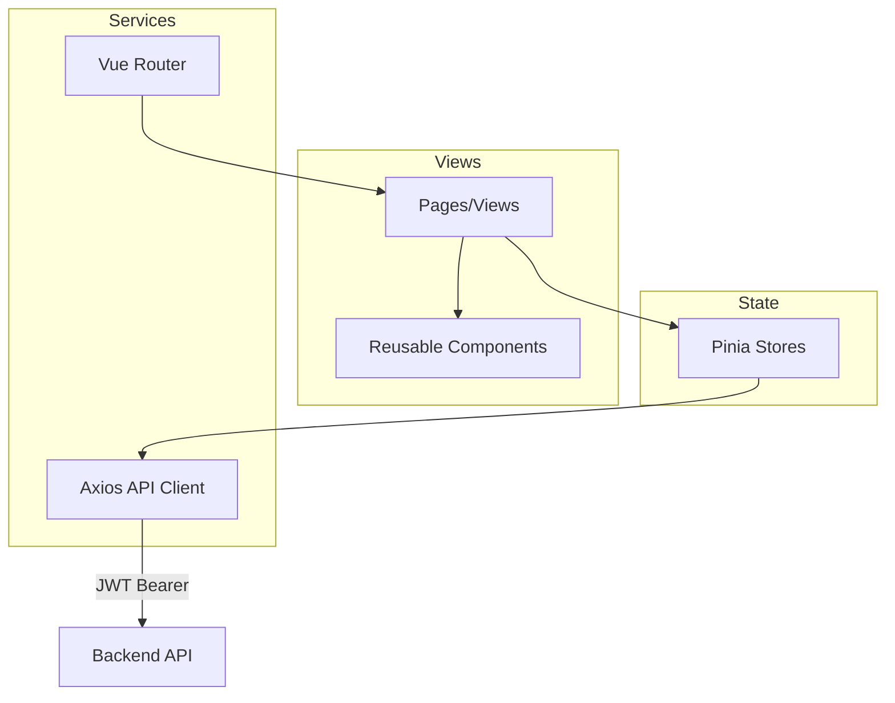
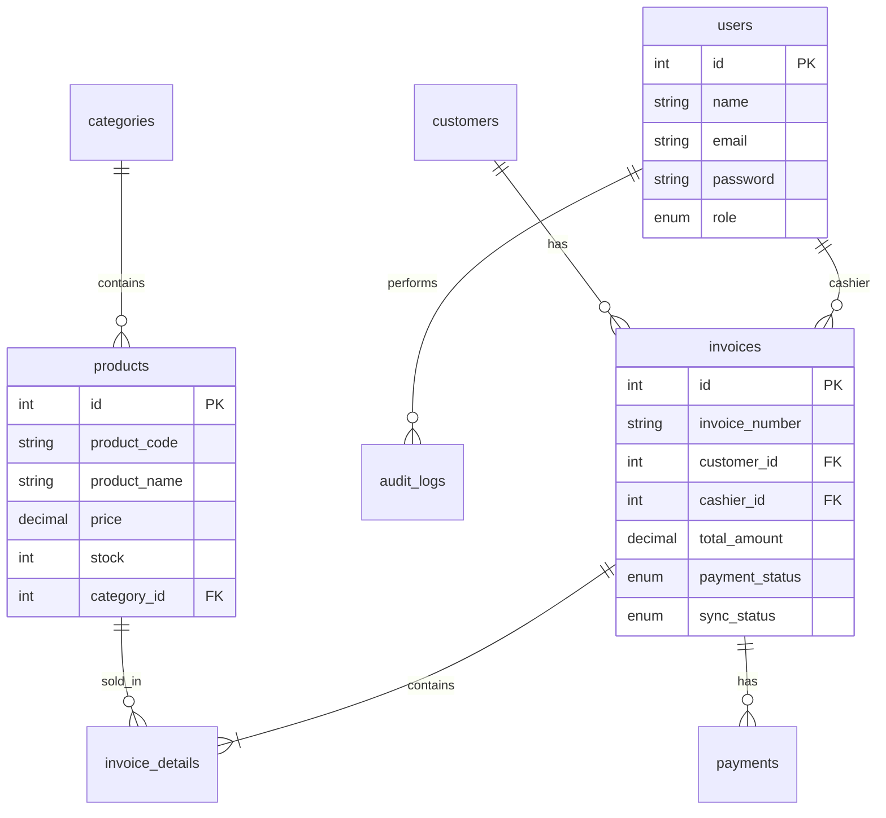
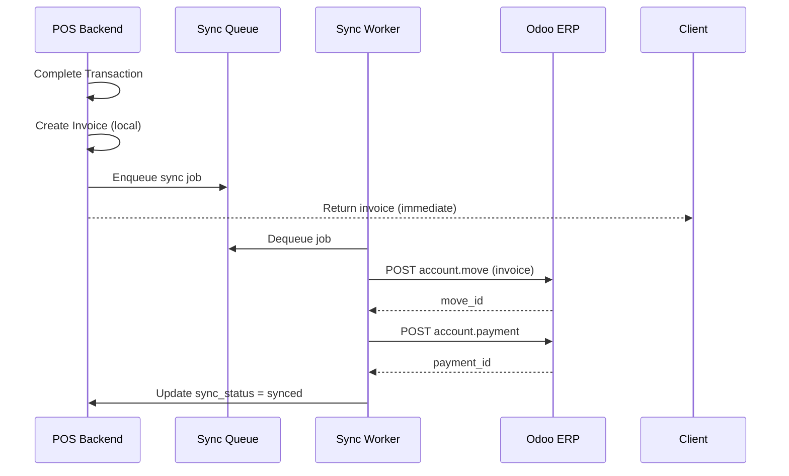
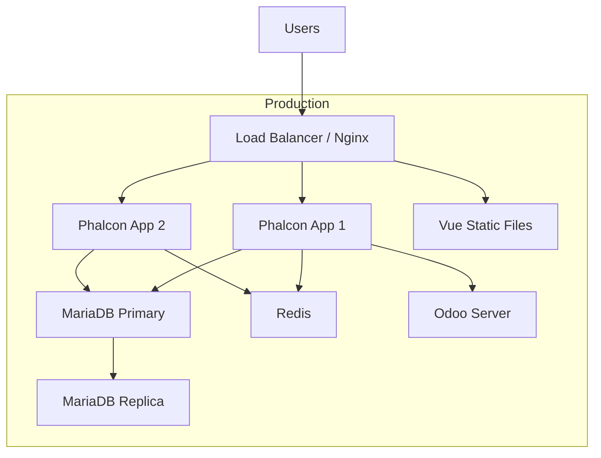
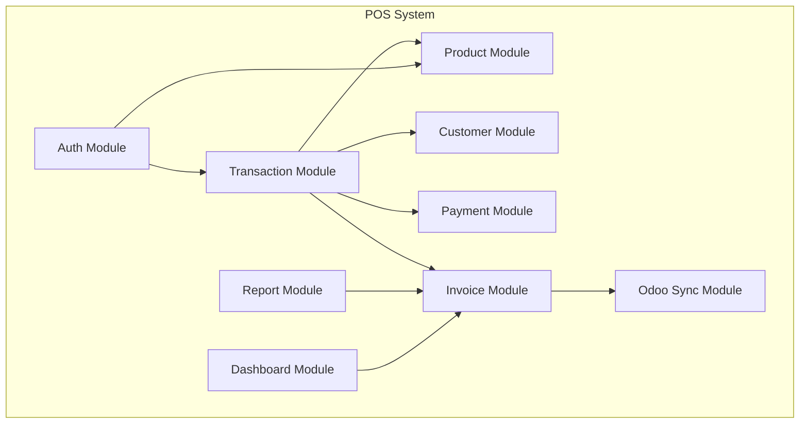
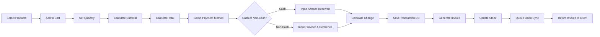

# System Architecture Document

## 1. Executive Summary

Aplikasi POS ini dirancang dengan **Clean Architecture** dan **Layered Architecture** untuk memisahkan concern bisnis, infrastruktur, dan presentasi. Integrasi Odoo Accounting dilakukan secara asynchronous melalui queue-based sync untuk memastikan transaksi POS tetap cepat meskipun Odoo sementara tidak tersedia.

---

## 2. High Level Architecture



### Alasan Pemilihan

| Keputusan | Alasan |
|-----------|--------|
| Phalcon PHP | C-extension, performa tinggi untuk transaksi real-time POS |
| Vue.js SPA | Reactive UI, ecosystem matang (Pinia, Router) |
| MariaDB | ACID compliance, kompatibel MySQL, cocok untuk transaksi |
| Async Odoo Sync | POS tidak blocking saat Odoo down; retry otomatis |
| Redis Queue | Job queue ringan untuk sync invoice/payment |

---

## 3. Backend Architecture



### Layer Responsibilities

| Layer | Folder | Tanggung Jawab |
|-------|--------|----------------|
| Presentation | `controllers/`, `middleware/` | HTTP request/response, auth gate |
| Application | `services/`, `validators/` | Business logic, orchestration |
| Domain | `models/`, `repositories/` | Data access abstraction |
| Infrastructure | `config/`, `helpers/` | External systems, logging |

### Keuntungan Clean Architecture

1. **Testability** – Services dapat di-unit test tanpa HTTP
2. **Maintainability** – Perubahan DB tidak mempengaruhi controller
3. **Scalability** – Service layer dapat di-extract ke microservice di masa depan

---

## 4. Frontend Architecture



### State Management (Pinia)

| Store | State | Actions |
|-------|-------|---------|
| `auth` | user, token, role | login, logout, refresh |
| `cart` | items, customer | addItem, removeItem, clear |
| `products` | list, filters | fetch, search |
| `dashboard` | metrics | fetchStats |

---

## 5. Database Architecture



**Normalisasi:** Database menggunakan **3NF (Third Normal Form)** – tidak ada transitive dependency, setiap non-key attribute dependen hanya pada primary key.

---

## 6. Odoo Integration Architecture



### Sync Strategy

| Status | Meaning |
|--------|---------|
| `pending` | Belum dikirim ke Odoo |
| `syncing` | Sedang proses sync |
| `synced` | Berhasil di Odoo |
| `failed` | Gagal, akan retry |
| `manual_review` | Gagal setelah max retry |

---

## 7. API Architecture

- **Style:** RESTful JSON
- **Versioning:** `/api/v1/...`
- **Auth:** JWT Bearer Token
- **Response Format:**

```json
{
  "success": true,
  "data": {},
  "message": "Operation successful",
  "meta": { "page": 1, "total": 100 }
}
```

---

## 8. Deployment Architecture



---

## 9. Component Diagram



---

## 10. Data Flow Diagram – Sales Transaction



---

## 11. Security Architecture

| Layer | Mechanism |
|-------|-----------|
| Transport | HTTPS/TLS 1.2+ |
| Authentication | JWT (HS256, 8h expiry) |
| Authorization | RBAC (admin, manager, cashier) |
| Input | Validator layer + prepared statements |
| Password | bcrypt (cost 12) |
| Audit | audit_logs table |
| API | Rate limiting via middleware |

---

## 12. Scalability Considerations

1. **Horizontal scaling** – Stateless API behind load balancer
2. **Read replica** – Reports query replica DB
3. **Caching** – Product catalog cached in Redis (TTL 5 min)
4. **Async sync** – Odoo integration tidak blocking checkout
5. **Indexed queries** – Composite index on `invoices(created_at, payment_status)`
