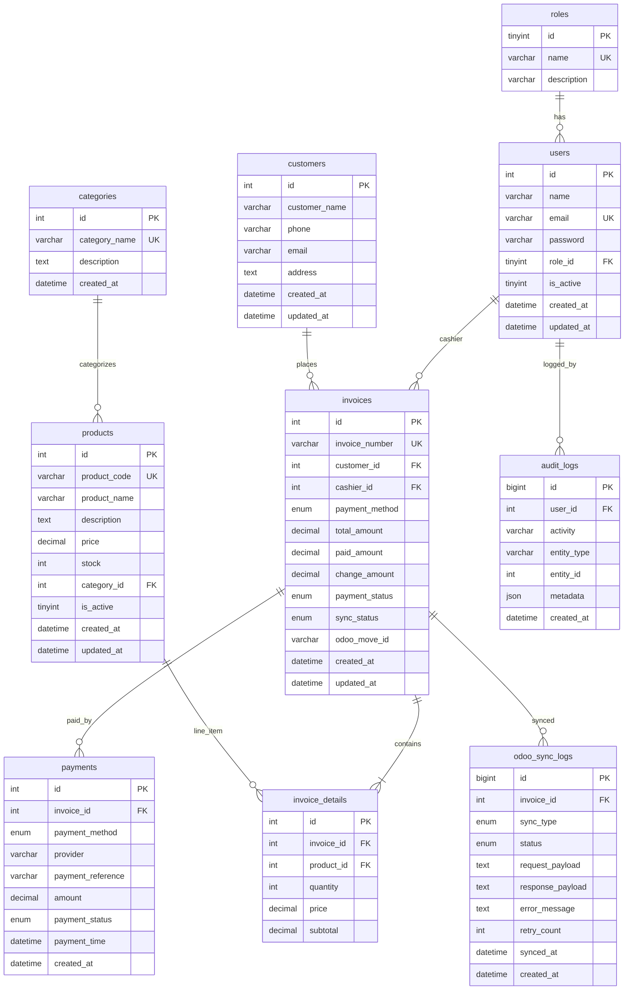

# Database Design Document

## 1. Overview

Database MariaDB dengan normalisasi **Third Normal Form (3NF)** untuk menghindari redundansi dan anomaly insert/update/delete.

---

## 2. Entity Relationship Diagram



---

## 3. Normalization Explanation

### 1NF – First Normal Form
- Semua kolom atomic (tidak ada array/JSON untuk data bisnis utama)
- Setiap cell berisi single value
- Contoh: alamat customer satu field `address` (bisa dipecah di v2)

### 2NF – Second Normal Form
- Semua non-key attributes fully dependent on primary key
- `invoice_details.subtotal` = f(quantity, price) per line – dependen pada `invoice_details.id`

### 3NF – Third Normal Form
- Tidak ada transitive dependency
- Role disimpan di tabel `roles` terpisah, bukan duplikasi string di `users`
- Product info tidak di-copy ke invoice_details kecuali `price` (snapshot harga saat transaksi)

### Denormalization (Intentional)
- `invoice_details.price` – snapshot harga saat penjualan (audit trail)
- `invoices.total_amount` – cached sum untuk query cepat dashboard

---

## 4. Table Relationships

| Parent | Child | Relationship | On Delete |
|--------|-------|--------------|-----------|
| roles | users | 1:N | RESTRICT |
| categories | products | 1:N | SET NULL |
| users | invoices | 1:N | RESTRICT |
| customers | invoices | 1:N | RESTRICT |
| invoices | invoice_details | 1:N | CASCADE |
| invoices | payments | 1:N | CASCADE |
| products | invoice_details | 1:N | RESTRICT |
| users | audit_logs | 1:N | SET NULL |
| invoices | odoo_sync_logs | 1:N | CASCADE |

---

## 5. Indexes

| Table | Index | Purpose |
|-------|-------|---------|
| products | idx_product_code | Fast lookup by barcode/code |
| products | idx_category_id | Filter by category |
| invoices | idx_created_at | Dashboard date range |
| invoices | idx_sync_status | Odoo sync worker |
| invoices | idx_payment_status | Payment reports |
| invoice_details | idx_invoice_id | Join optimization |
| audit_logs | idx_user_created | User activity audit |

---

## 6. Enum Values

### users.role (via roles table)
- `administrator`
- `manager`
- `cashier`

### invoices.payment_method
- `cash`, `qris`, `transfer`, `ewallet`

### invoices.payment_status
- `pending`, `paid`, `partial`, `failed`, `cancelled`

### invoices.sync_status
- `pending`, `syncing`, `synced`, `failed`, `manual_review`

### payments.payment_status
- `pending`, `paid`, `failed`, `cancelled`

---

## 7. Migration Files

| File | Description |
|------|-------------|
| `001_initial_schema.sql` | Create all tables |
| `002_add_indexes.sql` | Performance indexes |
| `003_odoo_sync_logs.sql` | Sync logging table |

See `database/migrations/` for executable SQL.

---

## 8. Sample Queries

### Dashboard – Total Sales Today

```sql
SELECT COALESCE(SUM(total_amount), 0) AS total_sales
FROM invoices
WHERE DATE(created_at) = CURDATE()
  AND payment_status = 'paid';
```

### Top Selling Products (Monthly)

```sql
SELECT p.product_name, SUM(id.quantity) AS total_qty, SUM(id.subtotal) AS revenue
FROM invoice_details id
JOIN products p ON p.id = id.product_id
JOIN invoices i ON i.id = id.invoice_id
WHERE YEAR(i.created_at) = YEAR(CURDATE())
  AND MONTH(i.created_at) = MONTH(CURDATE())
  AND i.payment_status = 'paid'
GROUP BY p.id, p.product_name
ORDER BY total_qty DESC
LIMIT 10;
```

### Payment Statistics

```sql
SELECT payment_method, COUNT(*) AS count, SUM(amount) AS total
FROM payments
WHERE payment_status = 'paid'
  AND DATE(created_at) = CURDATE()
GROUP BY payment_method;
```
