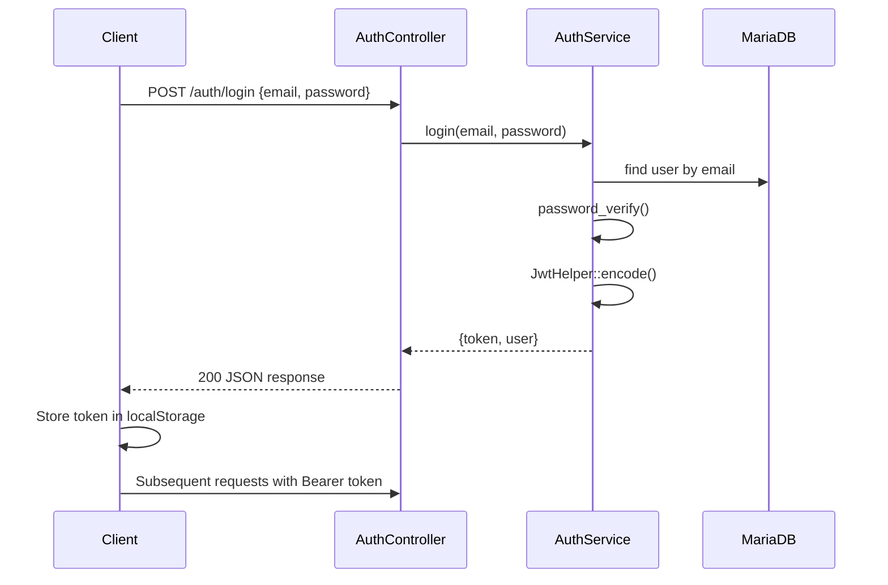

# Technical Documentation

## 1. System Overview

Aplikasi POS enterprise dengan arsitektur 3-tier:
- **Presentation:** Vue.js SPA
- **Application:** Phalcon PHP REST API
- **Data:** MariaDB + Odoo PostgreSQL

---

## 2. Development Setup

### Backend Requirements

```bash
# Install Phalcon extension (Windows/Linux)
# PHP 8.1+, Composer, MariaDB

cd backend
composer install
cp .env.example .env
```

Configure `.env` with database credentials.

**Nginx config snippet:**
```nginx
server {
    listen 8080;
    root /path/to/POS/backend/public;
    index index.php;

    location / {
        try_files $uri $uri/ /index.php?_url=$uri&$args;
    }

    location ~ \.php$ {
        fastcgi_pass 127.0.0.1:9000;
        fastcgi_param SCRIPT_FILENAME $document_root$fastcgi_script_name;
        include fastcgi_params;
    }
}
```

### Frontend Requirements

```bash
cd frontend
npm install
cp .env.example .env
npm run dev
```

Access: http://localhost:5173

### Database Setup

```bash
mysql -u root -p < database/migrations/001_initial_schema.sql
mysql -u root -p < database/seeds/001_seed_data.sql
```

---

## 3. Authentication Flow



### JWT Payload

```json
{
  "sub": 1,
  "email": "admin@pos.local",
  "name": "Administrator",
  "role": "administrator",
  "iat": 1718745600,
  "exp": 1718774400
}
```

---

## 4. Transaction Processing

### Atomic Database Transaction

```php
$db->begin();
try {
    // 1. Create invoice
    // 2. Create invoice_details
    // 3. Decrement stock
    // 4. Create payment
    // 5. Audit log
    $db->commit();
} catch (\Exception $e) {
    $db->rollback();
    throw $e;
}
```

### Invoice Number Format

`INV-YYYYMMDD-XXXX` where XXXX is daily sequential counter.

---

## 5. Payment Processing

| Method | paid_amount | change_amount | provider | reference |
|--------|-------------|---------------|----------|-----------|
| cash | user input | paid - total | null | null |
| qris | total | 0 | required | required |
| transfer | total | 0 | required | required |
| ewallet | total | 0 | required | required |

---

## 6. Odoo Sync Worker

Run as cron or queue worker:

```bash
# Every 5 minutes - retry failed syncs
*/5 * * * * php /path/to/backend/cli/sync_odoo.php
```

Sync states: `pending → syncing → synced | failed → manual_review`

---

## 7. Logging

Location: `backend/storage/logs/app.log`

Format: Monolog with levels DEBUG, INFO, WARNING, ERROR.

---

## 8. Code Standards

- PSR-4 autoloading
- Strict types enabled
- Service layer for business logic
- Controllers thin (delegate to services)
- Repository for complex queries
- Prepared statements via Phalcon ORM/DB

---

## 9. Testing with Postman

1. Login → save token
2. Set Authorization: Bearer {{token}}
3. Test CRUD endpoints
4. Create transaction → verify invoice
5. Check dashboard stats

---

## 10. Troubleshooting

| Issue | Solution |
|-------|----------|
| 401 Unauthorized | Check token expiry, re-login |
| Insufficient stock | Verify product stock in DB |
| Odoo sync failed | Check ODOO_* env vars, Odoo server status |
| CORS error | Verify CorsMiddleware, Vite proxy config |
